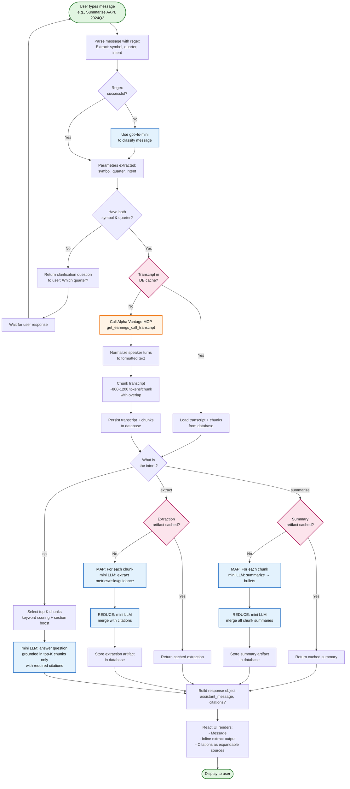

# Architecture Diagram: Earnings Call Analysis LLM Flow

## MAP/REDUCE Pattern Explained

**Problem:** Earnings transcripts are too long (~50K tokens) to fit in a single LLM call.

**Solution:** MAP/REDUCE pattern
- **MAP:** Split transcript into chunks → process each chunk independently → get N results
  - Example: 50 chunks × "summarize this chunk" = 50 mini-summaries
- **REDUCE:** Combine all chunk results → merge into final output
  - Example: Take 50 mini-summaries → "merge into one coherent summary" = 1 final summary

**Analogy:** Like having 50 people each read one chapter of a book (MAP), then one person reads all their notes and writes the final report (REDUCE).

## Full System Flowchart

## Cost-Saving Notes

- **Caching layers:**
  - Transcript cache: `(symbol, quarter)` → avoid re-fetching from MCP
  - Chunk cache: tied to `transcript_id` → avoid re-chunking
  - Artifact cache: `(transcript_id, intent, model, prompt_version)` → avoid re-running expensive LLM calls

- **Model usage (MVP - gpt-4o-mini only):**
  - Parser: regex first, gpt-4o-mini fallback for ambiguous messages
  - Summarize: mini (map) + mini (reduce)
  - Extract: mini (map) + mini (reduce)
  - Q&A: mini with citations
  - Chunk selection: keyword/section heuristic scoring (no LLM needed)

- **Future optimization paths:**
  - Add aggressive caching to minimize repeated LLM calls (biggest cost saver)
  - If complex reasoning needed: upgrade specific flows to gpt-4o
  - Keep all flows on mini until proven inadequate

## Data Flow Summary

1. **User message** → parsed into `(symbol, quarter, intent)`
2. **Transcript fetch** → MCP call if cache miss → normalize + chunk → persist
3. **Intent routing** → summarize | extract | qa
4. **LLM pipeline** → always check cache first, use mini (MVP), require citations
5. **Response** → structured JSON with text output and optional citations
6. **UI render** → ChatGPT-like display with expandable sources
