# Architecture Diagram: Earnings Call Analysis LLM Flow

## System Overview

**ECAA (Earnings Call Analysis Agent)** is a conversational agent that helps users analyze earnings call transcripts through natural language. Users can fetch transcripts, get summaries, extract key metrics, or ask specific questions.

## MAP/REDUCE Pattern Explained

**Problem:** Earnings transcripts are too long (~50K tokens) to fit in a single LLM call.

**Solution:** MAP/REDUCE pattern
- **MAP:** Split transcript into chunks → process each chunk independently → get N results
  - Example: 50 chunks × "summarize this chunk" = 50 mini-summaries
- **REDUCE:** Combine all chunk results → merge into final output
  - Example: Take 50 mini-summaries → "merge into one coherent summary" = 1 final summary

**Analogy:** Like having 50 people each read one chapter of a book (MAP), then one person reads all their notes and writes the final report (REDUCE).

## Key Features Implemented

✅ **Conversational Interface:** Natural language interaction with chat-based API  
✅ **Multi-Intent Support:** Fetch, summarize, extract, and Q&A capabilities  
✅ **Smart Caching:** Transcripts, chunks, and artifacts cached to minimize API costs  
✅ **Grounded Q&A:** Answers with source citations from specific chunks  
✅ **Conversation State:** Maintains context across multi-turn interactions  
✅ **Error Handling:** Graceful degradation for missing transcripts and rate limits

## Full System Flowchart

```mermaid
flowchart TD
    Start([User submits message<br/>e.g., 'Summarize AAPL 2024Q2'])
    
    Start --> SendAPI[POST /api/chat/<br/>conversationId: optional<br/>message: string]
    
    SendAPI --> GetOrCreateConv{Conversation<br/>exists?}
    
    GetOrCreateConv -->|No| CreateConv[Create new Conversation<br/>in Django DB]
    GetOrCreateConv -->|Yes| LoadConv[Load existing Conversation]
    
    CreateConv --> SaveUserMsg
    LoadConv --> SaveUserMsg[Save user Message<br/>with role='user']
    
    SaveUserMsg --> DetectIntent[Keyword-based intent detection:<br/>- 'fetch' → fetch<br/>- 'summarize' → summarize<br/>- 'extract' → extract<br/>- default → qa]
    
    DetectIntent --> ExtractParams[Regex extract:<br/>- Symbol: 2-5 uppercase letters<br/>- Quarter: Q1-Q4 + any 4-digit year]
    
    ExtractParams --> RouteIntent{Route by<br/>intent}
    
    RouteIntent -->|fetch| NeedTranscript1
    RouteIntent -->|summarize| NeedTranscript2
    RouteIntent -->|extract| NeedTranscript3
    RouteIntent -->|qa| NeedTranscript4
    
    NeedTranscript1{Has current<br/>transcript?}
    NeedTranscript2{Has current<br/>transcript?}
    NeedTranscript3{Has current<br/>transcript?}
    NeedTranscript4{Has current<br/>transcript?}
    
    NeedTranscript1 -->|Yes| AlreadyLoaded[Return: Already have<br/>SYMBOL QUARTER transcript]
    NeedTranscript1 -->|No| CheckParams1
    
    NeedTranscript2 -->|Yes| CheckSummaryCache
    NeedTranscript2 -->|No| CheckParams2
    
    NeedTranscript3 -->|Yes| CheckExtractCache
    NeedTranscript3 -->|No| CheckParams3
    
    NeedTranscript4 -->|No| AskForTranscript[Ask user to specify<br/>symbol + quarter first]
    NeedTranscript4 -->|Yes| RetrieveChunks
    
    CheckParams1{Has symbol<br/>AND quarter?}
    CheckParams2{Has symbol<br/>AND quarter?}
    CheckParams3{Has symbol<br/>AND quarter?}
    
    CheckParams1 -->|No| AskClarification1[Ask: Which ticker/quarter?]
    CheckParams2 -->|No| AskClarification2[Ask: Which ticker/quarter?]
    CheckParams3 -->|No| AskClarification3[Ask: Which ticker/quarter?]
    
    CheckParams1 -->|Yes| FetchTranscript1
    CheckParams2 -->|Yes| FetchTranscript2
    CheckParams3 -->|Yes| FetchTranscript3
    
    FetchTranscript1[MCP JSON-RPC call:<br/>Alpha Vantage<br/>get_earnings_call_transcript]
    FetchTranscript2[MCP JSON-RPC call:<br/>Alpha Vantage<br/>get_earnings_call_transcript]
    FetchTranscript3[MCP JSON-RPC call:<br/>Alpha Vantage<br/>get_earnings_call_transcript]
    
    FetchTranscript1 --> ParseTurns1[Parse structured turns<br/>to Transcript + TranscriptTurn]
    FetchTranscript2 --> ParseTurns2[Parse structured turns<br/>to Transcript + TranscriptTurn]
    FetchTranscript3 --> ParseTurns3[Parse structured turns<br/>to Transcript + TranscriptTurn]
    
    ParseTurns1 --> ChunkIt1[Auto-chunk transcript:<br/>~1000 tokens/chunk<br/>150 token overlap<br/>detect sections prepared/qa]
    ParseTurns2 --> ChunkIt2[Auto-chunk transcript:<br/>~1000 tokens/chunk<br/>150 token overlap<br/>detect sections prepared/qa]
    ParseTurns3 --> ChunkIt3[Auto-chunk transcript:<br/>~1000 tokens/chunk<br/>150 token overlap<br/>detect sections prepared/qa]
    
    ChunkIt1 --> SaveTranscript1[Persist Transcript<br/>+ TranscriptChunk to DB]
    ChunkIt2 --> SaveTranscript2[Persist Transcript<br/>+ TranscriptChunk to DB]
    ChunkIt3 --> SaveTranscript3[Persist Transcript<br/>+ TranscriptChunk to DB]
    
    SaveTranscript1 --> SetCurrentTranscript1[Set conversation.current_transcript]
    SaveTranscript2 --> SetCurrentTranscript2[Set conversation.current_transcript]
    SaveTranscript3 --> SetCurrentTranscript3[Set conversation.current_transcript]
    
    SetCurrentTranscript1 --> AlreadyLoaded
    SetCurrentTranscript2 --> CheckSummaryCache
    SetCurrentTranscript3 --> CheckExtractCache
    
    CheckSummaryCache{Summary Artifact<br/>cached?}
    CheckExtractCache{Extraction Artifact<br/>cached?}
    
    CheckSummaryCache -->|Yes| ReturnCachedSummary[Load cached summary<br/>from Artifact table]
    CheckSummaryCache -->|No| MapSummarize
    
    CheckExtractCache -->|Yes| ReturnCachedExtract[Load cached extraction<br/>from Artifact table]
    CheckExtractCache -->|No| MapExtract
    
    MapSummarize[MAP Phase:<br/>For each chunk call gpt-4o-mini<br/>with summarization prompt<br/>→ JSON with bullets]
    
    MapSummarize --> ReduceSummarize[REDUCE Phase:<br/>Merge all chunk summaries<br/>via gpt-4o-mini<br/>→ final JSON with bullets]
    
    ReduceSummarize --> SaveSummaryArtifact[Save Artifact<br/>type='summary'<br/>to DB for caching]
    
    SaveSummaryArtifact --> ReturnCachedSummary
    
    MapExtract[MAP Phase:<br/>For each chunk call gpt-4o-mini<br/>with extraction prompt<br/>→ JSON with metrics/guidance/risks]
    
    MapExtract --> ReduceExtract[REDUCE Phase:<br/>Merge all extractions<br/>via gpt-4o-mini<br/>→ final JSON structure]
    
    ReduceExtract --> SaveExtractArtifact[Save Artifact<br/>type='extraction'<br/>to DB for caching]
    
    SaveExtractArtifact --> ReturnCachedExtract
    
    ReturnCachedSummary --> FormatSummary[Format summary JSON<br/>to readable text:<br/>bullets with headers]
    ReturnCachedExtract --> FormatExtract[Format extraction JSON<br/>to readable text:<br/>metrics, guidance, risks, tone]
    
    FormatSummary --> BuildResponse
    FormatExtract --> BuildResponse
    
    RetrieveChunks[Keyword scoring:<br/>- Count query word overlaps<br/>- Boost QA chunks for questions<br/>- Select top-K=8 chunks]
    
    RetrieveChunks --> FormatContext[Format chunks with<br/>citation markers:<br/>=== CHUNK ID: uuid ===<br/>Section: prepared/qa<br/>text...]
    
    FormatContext --> CallQA[Call gpt-4o-mini<br/>with grounded Q&A prompt:<br/>- Answer from context only<br/>- Cite sources<br/>max_tokens=2000]
    
    CallQA --> ParseQAResponse[Parse JSON response:<br/>- answer: string<br/>- citations: array<br/>- confidence: high/medium/low]
    
    ParseQAResponse --> ValidateCitations[Validate citations:<br/>- chunk_id must exist<br/>- Filter invalid ones]
    
    ValidateCitations --> BuildResponse
    
    AlreadyLoaded --> BuildResponse
    AskClarification1 --> BuildResponse
    AskClarification2 --> BuildResponse
    AskClarification3 --> BuildResponse
    AskForTranscript --> BuildResponse
    
    BuildResponse[Build response JSON:<br/>- conversation_id<br/>- assistant_message<br/>- citations array<br/>- intent<br/>- needs_clarification]
    
    BuildResponse --> SaveAssistantMsg[Save Message<br/>role='assistant'<br/>content + citations<br/>to DB]
    
    SaveAssistantMsg --> ReturnJSON[Return JSON to React:<br/>- conversation_id<br/>- assistant_message<br/>- citations<br/>- intent]
    
    ReturnJSON --> End([Response displayed to user])
    
    style Start fill:#e1f5e1,color:#111,stroke:#2e7d32,stroke-width:3px
    style End fill:#e1f5e1,color:#111,stroke:#2e7d32,stroke-width:3px
    style FetchTranscript1 fill:#fff4e6,color:#111,stroke:#ef6c00,stroke-width:2px
    style FetchTranscript2 fill:#fff4e6,color:#111,stroke:#ef6c00,stroke-width:2px
    style FetchTranscript3 fill:#fff4e6,color:#111,stroke:#ef6c00,stroke-width:2px
    style MapSummarize fill:#e3f2fd,color:#111,stroke:#1565c0,stroke-width:2px
    style ReduceSummarize fill:#e3f2fd,color:#111,stroke:#1565c0,stroke-width:2px
    style MapExtract fill:#e3f2fd,color:#111,stroke:#1565c0,stroke-width:2px
    style ReduceExtract fill:#e3f2fd,color:#111,stroke:#1565c0,stroke-width:2px
    style CallQA fill:#e3f2fd,color:#111,stroke:#1565c0,stroke-width:2px
    style CheckSummaryCache fill:#fce4ec,color:#111,stroke:#ad1457,stroke-width:2px
    style CheckExtractCache fill:#fce4ec,color:#111,stroke:#ad1457,stroke-width:2px
    style FormatSummary fill:#f3e5f5,color:#111,stroke:#6a1b9a,stroke-width:2px
    style FormatExtract fill:#f3e5f5,color:#111,stroke:#6a1b9a,stroke-width:2px
    style RenderUI fill:#e8f5e9,color:#111,stroke:#2e7d32,stroke-width:2px
```



## User Journey Paths

ECAA supports multiple conversation flows depending on user intent. Here are the main paths a user can take:

### Path 1: Quick Summary Flow
**Goal:** Get a high-level overview of an earnings call

```
User: "Summarize AAPL 2024Q2"
  ↓
System: [Fetches transcript if needed]
  ↓
System: [MAP/REDUCE summarization]
  ↓
Assistant: "Here's the summary for AAPL 2024Q2:

**Executive Summary:**
• Revenue up 15% YoY to $85.8B
• iPhone revenue grew 11% driven by strong demand
• Services revenue hit all-time high of $21.2B
• Guidance: Expecting similar growth in Q3
• Management tone optimistic about AI initiatives"
```

**Cache behavior:** Second request returns instantly from cache

---

### Path 2: Deep Dive Extraction Flow
**Goal:** Get structured insights (metrics, guidance, risks, tone)

```
User: "Extract key metrics from TSLA Q1 2024"
  ↓
System: [Fetches transcript if needed]
  ↓
System: [MAP/REDUCE extraction]
  ↓
Assistant: "Here are the extracted key metrics for TSLA Q1 2024:

**Key Metrics:**
• Revenue: $21.3B (down 9% YoY)
• Operating Margin: 5.5% (compressed from 11.4% prior year)
• Free Cash Flow: $2.1B positive

**Guidance:**
• Planning significant investment in AI/FSD
• Expect cost reductions from new manufacturing processes

**Risks:**
• Price competition in China intensifying
• Regulatory challenges in EU markets

**Tone:** cautiously optimistic - acknowledging near-term headwinds while emphasizing long-term strategy"
```

---

### Path 3: Interactive Q&A Flow
**Goal:** Ask specific questions about transcript content

```
User: "Load MSFT 2024Q2"
  ↓
Assistant: "Successfully fetched transcript for MSFT 2024Q2..."

User: "What did they say about Azure growth?"
  ↓
System: [Retrieves relevant chunks via keyword scoring]
  ↓
System: [Q&A with grounded citations]
  ↓
Assistant: "Azure revenue grew 29% year-over-year, driven by strong demand for AI services. The company highlighted that Azure OpenAI Service is now available in multiple regions..."

[Citations shown with expandable source chunks]

User: "What about operating margins?"
  ↓
Assistant: "Operating margins expanded to 46%, up from 44% in the prior year quarter..."
```

**Note:** Each question triggers a new LLM call (not cached), but uses fast keyword retrieval to select relevant chunks.

---

### Path 4: Clarification Flow
**Goal:** System asks for missing information

```
User: "Summarize the latest Apple earnings"
  ↓
System: [Detects missing quarter]
  ↓
Assistant: "I need the quarter (e.g., 'Q1 2024' or '2024Q1') to fetch the transcript. Please provide it in your message."

User: "Q2 2024"
  ↓
System: [Re-parses with context, extracts AAPL + Q2 2024]
  ↓
Assistant: "Here's the summary for AAPL 2024Q2..."
```

---

### Path 5: Multi-Turn Conversation Flow
**Goal:** Multiple operations on same transcript

```
User: "Fetch NVDA Q1 2024"
  ↓
Assistant: "Successfully fetched transcript for NVDA Q1 2024..."

User: "Summarize it"
  ↓
Assistant: [Returns summary - transcript already loaded]

User: "What were the data center numbers?"
  ↓
Assistant: [Q&A on same transcript]

User: "Now extract all the key metrics"
  ↓
Assistant: [Extraction on same transcript]

[NEW CHAT button clicked]

User: "Summarize AMD Q1 2024"
  ↓
System: [New conversation, fresh context]
```

**Conversation State:** 
- `conversation.current_transcript` tracks active transcript
- Enables seamless follow-up questions without re-specifying symbol/quarter
- "New Chat" button resets state for clean start

---

### Path 6: Error Handling Flow
**Goal:** Graceful degradation for edge cases

```
User: "Summarize XYZ 2024Q2"
  ↓
System: [Attempts MCP fetch]
  ↓
System: [TranscriptNotAvailable exception]
  ↓
Assistant: "Sorry, I couldn't find a transcript for XYZ 2024Q2. Please verify:
• The ticker symbol is correct
• The quarter is available (earnings may not be released yet)
• Try a different quarter"
```

**Or rate limit scenario:**

```
User: "Fetch AAPL 2024Q2"
  ↓
System: [Rate limit exceeded on Alpha Vantage]
  ↓
Assistant: "Alpha Vantage API rate limit exceeded. Please try again later or upgrade to premium tier for higher limits."
```

---

### Path 7: Already Loaded Flow
**Goal:** Avoid redundant fetches

```
User: "Fetch AAPL 2024Q2"
  ↓
Assistant: "Successfully fetched transcript for AAPL 2024Q2..."

User: "Fetch AAPL 2024Q2"
  ↓
System: [Detects current_transcript already set]
  ↓
Assistant: "I already have the transcript for AAPL 2024Q2. You can ask me to summarize it, extract key information, or ask specific questions."
```

## Implementation Details

### Intent Detection
- **Method:** Pure keyword matching (no LLM needed)
- **Patterns:**
  - `fetch`: "fetch", "get transcript", "load", "retrieve transcript"
  - `summarize`: "summarize", "summary", "give me a summary"
  - `extract`: "extract", "metrics", "guidance", "risks", "key numbers"
  - `qa`: Default for all other messages

### Symbol/Quarter Extraction
- **Symbol:** Regex matches 2-5 uppercase letters with word boundaries (`\b[A-Z]{2,5}\b`)
- **Quarter:** Flexible formats supported:
  - Formats: `Q1 2024`, `2024 Q1`, `2024Q1`, `Q1-2024`
  - Pattern: `(Q[1-4])\s*[-]?\s*(\d{4})|(\d{4})\s*[-]?\s*(Q[1-4])`
  - Accepts any 4-digit year (e.g., 2015, 2024, 2030)

### Transcript Fetching
- **MCP Client:** JSON-RPC over HTTP to Alpha Vantage MCP server
- **Endpoint:** `get_earnings_call_transcript(symbol, quarter)`
- **Response:** Structured JSON with `company`, `quarter`, `date`, `transcripts` (array of turns)
- **Normalization:** Convert structured turns to `Transcript` + `TranscriptTurn` Django models
- **Auto-chunking:** Immediately chunks transcript on first fetch

### Chunking Strategy
- **Target:** ~1000 tokens per chunk (max 1200)
- **Overlap:** 150 tokens between adjacent chunks
- **Section Detection:** Automatic detection of "prepared" vs "qa" sections
  - Triggers on keywords: "question and answer", "q&a session", "begin the question"
- **Storage:** `TranscriptChunk` model with fields:
  - `chunk_index`, `section`, `speaker`, `text`, `token_count`, `avg_turn_sentiment`

### MAP/REDUCE Pipelines

#### Summarization
1. **MAP Phase:**
   - Input: Individual chunk text
   - Prompt: "Extract key points as concise bullets"
   - Model: `gpt-4o-mini` (temp=0.3, max_tokens=500)
   - Output: JSON with `bullets` array and `mentions_guidance` boolean
   
2. **REDUCE Phase:**
   - Input: All chunk summaries concatenated
   - Prompt: "Merge into coherent final summary, deduplicate"
   - Model: `gpt-4o-mini` (temp=0.3)
   - Output: JSON with `bullets` array and `sections_covered`
   
3. **Caching:** Stored as `Artifact` with `type='summary'`

#### Extraction
1. **MAP Phase:**
   - Input: Individual chunk with chunk_id
   - Prompt: "Extract metrics, guidance, risks, tone from this chunk"
   - Model: `gpt-4o-mini` (temp=0.3, max_tokens=1500)
   - Output: JSON matching `EXTRACTION_SCHEMA` with citations
   
2. **REDUCE Phase:**
   - Input: All chunk extractions
   - Prompt: "Merge and deduplicate, maintain best citations"
   - Model: `gpt-4o-mini` (temp=0.3)
   - Output: Final merged JSON with all sections
   
3. **Caching:** Stored as `Artifact` with `type='extraction'`

#### Q&A (No MAP/REDUCE)
1. **Retrieval:**
   - Keyword scoring: Count query word overlaps in chunk text
   - Section boost: +0.2 score for QA chunks if query is a question
   - Select top-K=8 chunks
   
2. **Context Formatting:**
   ```
   === CHUNK ID: {chunk.id} ===
   Section: {chunk.section}
   {chunk.text}
   ```
   
3. **LLM Call:**
   - Model: `gpt-4o-mini` (max_tokens=2000)
   - System prompt: "Answer from context only, cite sources"
   - Output: JSON with `answer`, `citations` (array of chunk_id + quote), `confidence`
   
4. **Citation Validation:** Filter citations with invalid chunk_ids

5. **No Caching:** Each question is unique, not cached

### Formatting Layer
- **Purpose:** Transform LLM JSON artifacts into human-readable text
- **Location:** `agent/services/formatting.py`
- **Functions:**
  - `format_summary()`: Bullet list with "Executive Summary" header
  - `format_extraction()`: Sections for metrics, guidance, risks, tone
  - `format_artifact_content()`: Router that selects appropriate formatter

## Caching Strategy

### Three-Tier Cache System

1. **Transcript Cache:**
   - **Key:** `(symbol, quarter)` uniqueness constraint
   - **Value:** `Transcript` + related `TranscriptTurn` records
   - **Purpose:** Avoid re-fetching from Alpha Vantage MCP
   - **Invalidation:** Manual (transcripts don't change)

2. **Chunk Cache:**
   - **Key:** `transcript_id` foreign key
   - **Value:** `TranscriptChunk` records
   - **Purpose:** Avoid re-chunking on every request
   - **Lifecycle:** Created automatically on first transcript fetch, persists indefinitely

3. **Artifact Cache:**
   - **Key:** `(transcript_id, artifact_type, model, prompt_version)` uniqueness constraint
   - **Value:** `Artifact` record with JSON content
   - **Purpose:** Avoid re-running expensive MAP/REDUCE pipelines
   - **Scope:** 
     - `summary`: Cached
     - `extraction`: Cached
     - `qa`: NOT cached (questions are unique)
   - **Invalidation:** Change `prompt_version` to bust cache

### Cache Hit Patterns

**Scenario 1: First-time user asks for summary**
```
1. Fetch transcript from MCP (slow: ~2-5s)
2. Chunk transcript (fast: <1s)
3. MAP/REDUCE summarization (slow: ~10-30s depending on chunk count)
4. Cache all three levels
Total: 12-35s
```

**Scenario 2: Same user asks for extraction**
```
1. Transcript cache HIT (instant)
2. Chunk cache HIT (instant)
3. Artifact cache MISS for extraction
4. MAP/REDUCE extraction (slow: ~10-30s)
5. Cache artifact
Total: 10-30s
```

**Scenario 3: Another user asks for same symbol/quarter summary**
```
1. Transcript cache HIT (instant)
2. Chunk cache HIT (instant)
3. Artifact cache HIT for summary (instant)
4. Return formatted text
Total: <1s
```

**Scenario 4: User asks question**
```
1. Transcript cache HIT (instant)
2. Chunk cache HIT (instant)
3. Keyword retrieval (fast: <100ms)
4. Q&A LLM call (moderate: 2-5s)
Total: 2-5s (not cached, but fast)
```

## Cost Analysis

### OpenAI API Usage (gpt-4o-mini)

**Per Transcript Analysis (first time, no cache):**

1. **Summarization:**
   - MAP: 50 chunks × ~1000 tokens input × 500 tokens output = 75K tokens
   - REDUCE: ~5K tokens input × ~1K tokens output = 6K tokens
   - **Total: ~81K tokens**

2. **Extraction:**
   - MAP: 50 chunks × ~1000 tokens input × 1500 tokens output = 125K tokens
   - REDUCE: ~10K tokens input × ~2K tokens output = 12K tokens
   - **Total: ~137K tokens**

3. **Q&A (per question):**
   - 8 chunks × ~1000 tokens = 8K tokens input
   - Answer: ~500-2000 tokens output
   - **Total: ~9-10K tokens per question**

**Cost Estimates (gpt-4o-mini pricing):**
- Input: $0.15 / 1M tokens
- Output: $0.60 / 1M tokens

- Summarization: ~$0.02 per transcript
- Extraction: ~$0.03 per transcript
- Q&A: ~$0.002 per question

**With Caching:**
- Second request for same transcript+intent: $0.00 (cache hit)
- Expected 80-90% cache hit rate in production → ~80-90% cost savings

### Alpha Vantage MCP Usage

- **Rate Limit:** 25 API calls per day (free tier)
- **Cost:** $0 (free tier) or ~$50/month (premium tier for higher limits)
- **Caching Impact:** Each unique (symbol, quarter) counts as 1 API call
- **Recommendation:** Start with free tier, upgrade based on unique transcript volume

## Data Flow Summary

### Request Flow
1. **Frontend:** User submits message via POST `/api/chat/`
2. **Backend:** Django receives request → `chat/services/__init__.py:process_message()`
3. **Orchestration:** Intent detection → symbol/quarter extraction → routing
4. **Service Layer:** Execute appropriate pipeline (summarize/extract/qa)
5. **LLM Calls:** OpenAI API with structured prompts and JSON schema responses
6. **Formatting:** Transform JSON artifacts → human-readable text
7. **Response:** Return JSON with `conversation_id`, `assistant_message`, `citations`
8. **Persistence:** All messages saved to `Message` model for conversation history

### Database Schema (Key Models)

**Transcript Flow:**
```
Transcript (symbol, quarter) 
  → TranscriptTurn (speaker, content, turn_index)
  → TranscriptChunk (text, section, token_count)
```

**Conversation Flow:**
```
Conversation (current_transcript FK)
  → Message (role, content, citations, message_index)
```

**Caching Flow:**
```
Artifact (transcript FK, artifact_type, model, prompt_version, content JSON)
```

---

## Technology Stack

### Backend (Django)
- **Framework:** Django 4.x with REST API
- **Database:** SQLite (dev) - easily upgradable to PostgreSQL
- **ORM:** Django Models for all data persistence
- **LLM Client:** OpenAI Python SDK (v1.x)
- **HTTP Client:** httpx for MCP communication
- **Key Models:**
  - `Transcript`, `TranscriptTurn`, `TranscriptChunk` (transcripts app)
  - `Conversation`, `Message` (chat app)
  - `Artifact` (agent app)

### Frontend (React)
- **Framework:** React 18 with Vite
- **UI Library:** Material-UI (MUI) v5
- **State Management:** React hooks (useState, useEffect)
- **Styling:** MUI theme + custom CSS for animations
- **HTTP Client:** Fetch API

### External Services
- **LLM:** OpenAI gpt-4o-mini via API
- **Transcript Source:** Alpha Vantage MCP server (JSON-RPC)

### Key Files Reference

**Backend:**
```
backend/
├── chat/services/__init__.py          # Main orchestration logic
├── agent/services/
│   ├── summarize.py                   # MAP/REDUCE summarization
│   ├── extract.py                     # MAP/REDUCE extraction
│   ├── qa.py                          # Q&A with citations
│   ├── prompts.py                     # LLM prompt templates
│   └── formatting.py                  # JSON → readable text
├── transcripts/services/
│   ├── fetch_alpha_vantage.py         # MCP client
│   └── chunking.py                    # Chunking + retrieval
└── agent/schemas.py                   # JSON schemas for validation
```

**Frontend:**
```
frontend/src/
├── App.jsx                            # Main app with conversation state
├── api/chat.js                        # Backend API client
└── components/chat/                   # UI components for chat interface
```

---

## Future Enhancements

### Potential Improvements
1. **Semantic Search:** Replace keyword scoring with vector embeddings for better chunk retrieval
2. **Conversation History:** Persist and retrieve past conversations
3. **Export:** Generate transcripts, summaries, or extractions as PDF/CSV
4. **Comparison:** Compare metrics across multiple quarters or companies
5. **Streaming Responses:** WebSocket support for real-time token streaming
6. **Multi-model Support:** Allow selection between GPT-4 and GPT-4o-mini based on query complexity
7. **Custom Prompts:** User-configurable extraction fields or summary styles
8. **Section Analysis:** Dedicated analysis of specific sections (guidance, risks, Q&A)
9. **Batch Processing:** Process multiple transcripts in parallel
10. **API Authentication:** Add user authentication and rate limiting

### Scalability Considerations
- **Database:** Migrate to PostgreSQL with proper indexing
- **Caching:** Add Redis for session and artifact caching
- **Queueing:** Celery for async MAP/REDUCE jobs
- **Load Balancing:** Multiple Django instances behind nginx
- **Monitoring:** Add Sentry, DataDog, or similar for error tracking and performance

---

## Conclusion

ECAA provides a fully functional conversational interface for earnings call analysis with:
- ✅ Multi-intent support (fetch, summarize, extract, Q&A)
- ✅ Intelligent caching to minimize costs and API calls
- ✅ MAP/REDUCE pipelines for processing long documents
- ✅ Grounded Q&A with source citations and validation
- ✅ Graceful error handling and user guidance
- ✅ Conversation state management for multi-turn interactions

The system is production-ready for small-to-medium scale usage and can be scaled with the enhancements listed above.
